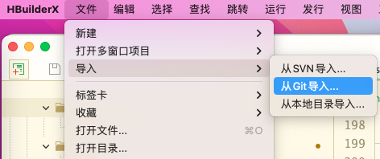
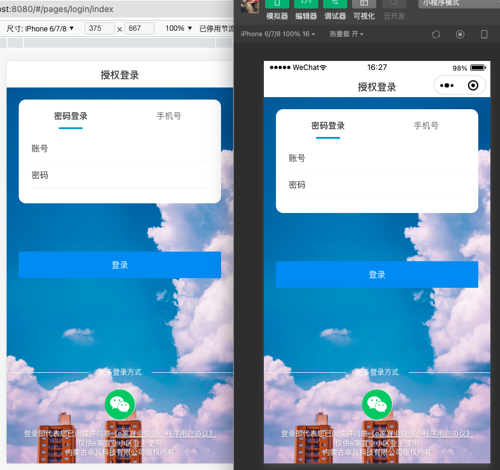
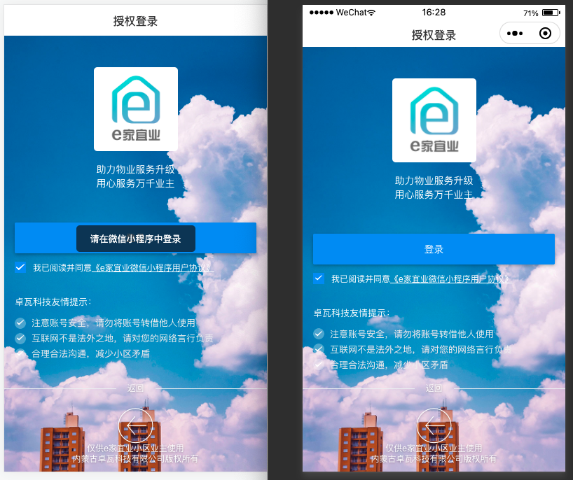
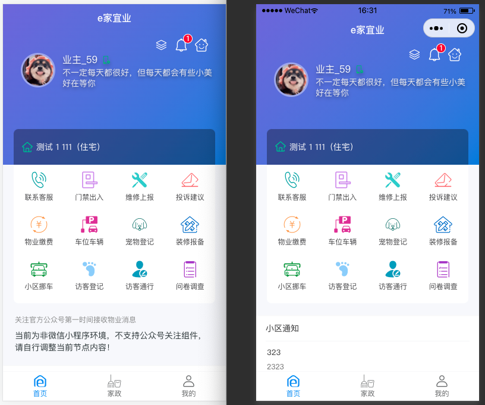
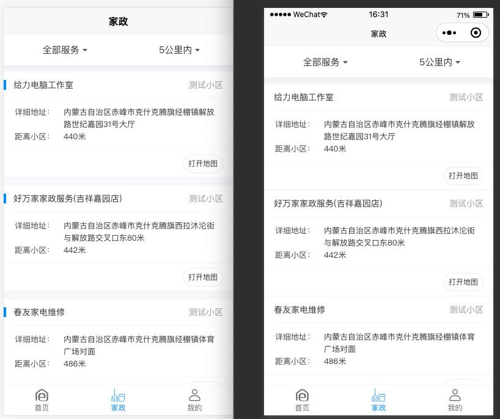
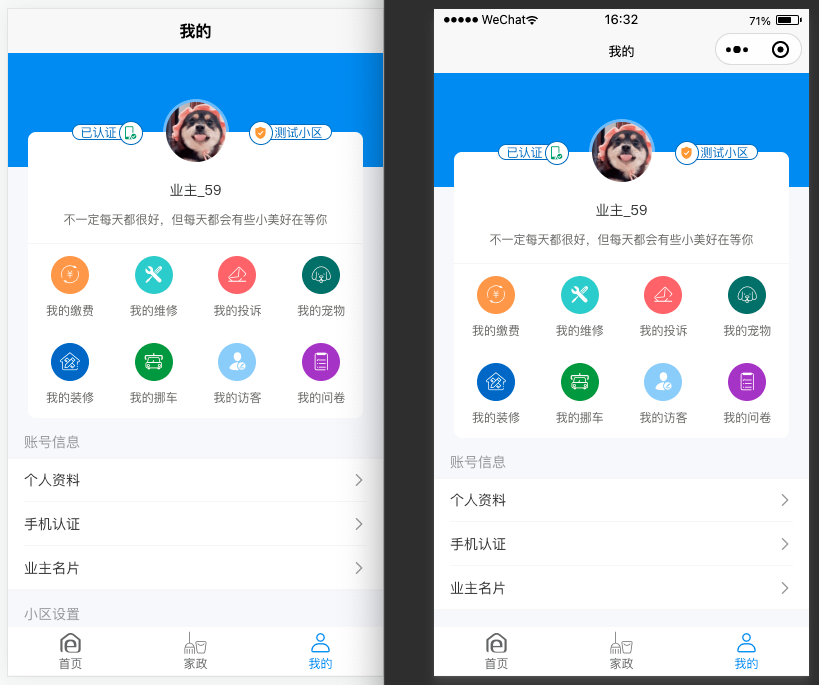

## 介绍

本项目为「e家宜业」微信小程序使用uniapp重构的版本。「e家宜业」是一整套基于AGPL开源协议开源的智慧物业解决方案。

友情链接：

<p align="center">
  <a href="https://gitee.com/chowa/ejyy.git">e家宜业 [Gitee]</a>&nbsp;
  <a href="https://github.com/chowa/ejyy.git">e家宜业 [GitHub]</a>
</p>

## UI框架

本项目使用ui框架：

<h1 align="center">CW UI</h1>

<p align="center">兼容uniapp、微信小程序的轻量移动端 Vue 组件库</p>

<p align="center">
    
    
    
</p>
<p align="center">
  🌵<a href="https://gitee.com/jarryxy/cw-ui">CW UI [Gitee]</a>&nbsp;
  🌟<a href="https://github.com/jarryxy/cw-ui">CW UI [GitHub]</a>
</p>

## 部署

在`HbuilderX`中选中从Git导入，填入本项目地址。



后端接口请部署使用`api-server`，相关修改请阅读`添加用户名密码登录接口`和`配置跨域`。

## 添加用户名密码登录接口

请部署`「e家宜业」`后台项目`api-server`后，添加如下文件：

```text
api-server    
├── src
│    └── module
│          └── mp
│               ├─ controller
|               |     └── user
|               |           └── login_username.ts // 添加文件
|               └── router.ts // 修改文件
└── ··· ···
```


`login_username.ts`

```ts
import { Action } from '~/types/action';
import { SUCCESS, WEHCAT_MP_LOGIN_ERROR,PWD_ERROR } from '~/constant/code';
import { INCOMPLETE_USER_INFO } from '~/constant/status';
import * as wechatService from '~/service/wechat';
import communityService from '~/service/community';
import utils from '~/utils';

interface RequestBody {
    account: string;
    password: string;
    brand?: string;
    model?: string;
    system?: string;
    platform?: string;
}

const MpUserLoginAction = <Action>{
    router: {
        path: '/user/login_username',
        method: 'post',
        authRequired: false
    },

    validator: {
        body: [
            {
                name: 'account',
                required: true
            },
            {
                name: 'password',
                required: true
            },
            {
                name: 'brand',
                required: false
            },
            {
                name: 'model',
                required: true
            },
            {
                name: 'system',
                required: true
            },
            {
                name: 'platform',
                required: true
            }
        ]
    },

    response: async ctx => {
        const { account, password, brand, model, system, platform } = <RequestBody>ctx.request.body;


        let mpUserInfo = await ctx.model
            .from('ejyy_wechat_mp_user')
            .leftJoin(
                'ejyy_wechat_official_accounts_user',
                'ejyy_wechat_official_accounts_user.union_id',
                'ejyy_wechat_mp_user.union_id'
            )
            .where('ejyy_wechat_mp_user.phone', account)
            .where('ejyy_wechat_mp_user.password',password)
            .select(
                'ejyy_wechat_mp_user.id',
                'ejyy_wechat_mp_user.nick_name',
                'ejyy_wechat_mp_user.phone',
                'ejyy_wechat_mp_user.gender',
                'ejyy_wechat_mp_user.avatar_url',
                'ejyy_wechat_mp_user.signature',
                'ejyy_wechat_mp_user.intact',
                'ejyy_wechat_mp_user.created_at',
                'ejyy_wechat_official_accounts_user.subscribed'
            )
            .first();

        let token = ''
        if (!mpUserInfo) {
            ctx.body = {
                code: PWD_ERROR,
                message: '账号或密码错误'
            };
            return
        } else {
            mpUserInfo.phone = utils.phone.hide(mpUserInfo.phone);
            token = utils.crypto.md5(`${mpUserInfo.id}${Date.now()}`);
            await ctx.model
                .from('ejyy_wechat_mp_auth')
                .where({ wechat_mp_user_id: mpUserInfo.id })
                .update({
                    token
                });
        }

        await ctx.model.from('ejyy_wechat_mp_user_login').insert({
            wechat_mp_user_id: mpUserInfo.id,
            ip: ctx.request.ip,
            brand,
            model,
            system,
            platform,
            login_at: Date.now()
        });

        const communityInfo = await communityService(ctx.model, mpUserInfo.id);

        ctx.body = {
            code: SUCCESS,
            data: {
                token,
                userInfo: mpUserInfo,
                communityInfo
            }
        };
    }
};

export default MpUserLoginAction;
```

`router.ts`

添加内容

```ts
export { default as MpUserLoginUsernameAction } from './controller/user/login_username';
```

## 配置跨域

配置跨域否则在h5端，由于浏览器的跨域限制会无法正常获取数据。

```sh
npm install koa-cors --save
```

```text
api-server    
├── src
│    └── app.ts // 修改文件
```

`app.ts`

```ts
import cors from "koa-cors";   //跨域
// 允许跨域
app.use(cors()); // 此行配置需要在路由配置之前
```


## 运行截图

左侧为H5端，右侧为微信小程序端。












